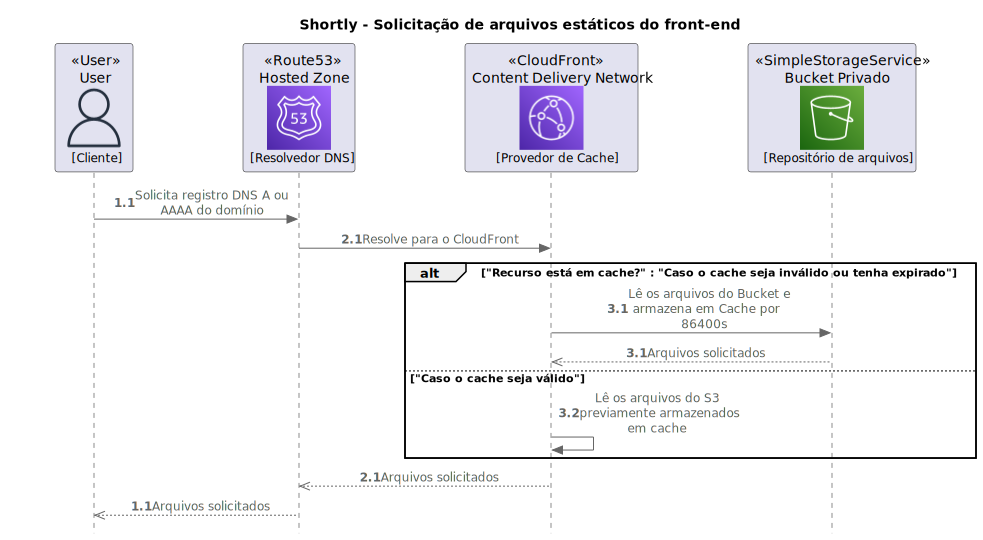
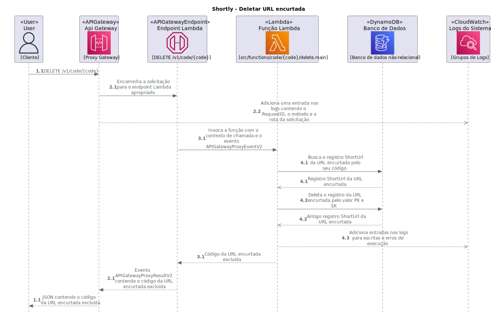
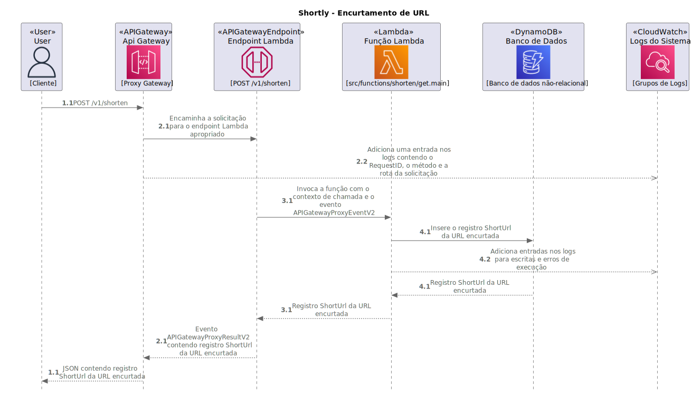

 

  

    
  

  

    
    
  

  <h3 align="center">Arquitetura de Referência</h3>

  

    Esse é um estudo sobre as arquiteturas de software Serverless (AWS Lambda), On-premises (Amazon EC2) e distribuídas (AWS Lambda + Amazon EC2).
     
    <a href="#"><strong>Explore as arquiteturas »</strong></a>
     
     
    <a href="https://shortly.com.br/">Shortly (Serverless)</a>
    ·
    <a href="https://shortly.digital/">Shortly (On-premises)</a>
  

<ol>
  <li><a href="#about-the-project">Sobre o projeto</a></li>
  <li><a href="#objectives">Objetivos do trabalho</a></li>
  <li><a href="#reference-architectures-aws">Arquiteturas de Referência da AWS</a></li>
  <li><a href="#reference-architectures">Arquiteturas de Referência</a></li>
  <li><a href="#proposed-architecture">Arquitetura Proposta</a></li>
  <li><a href="#advantages">Vantagens da arquitetura proposta</a></li>
  <li><a href="#disadvantages">Desvantagens da arquitetura proposta</a></li>
</ol>

## Sobre o trabalho

O propósito deste trabalho é analisar e comparar três diferentes arquiteturas de software da AWS para o projeto Shortly, a fim de identificar a arquitetura mais eficaz e eficiente com base em vários critérios, incluindo custo, desempenho, escalabilidade e resiliência. O objetivo é proporcionar uma compreensão mais profunda das vantagens e desvantagens de cada abordagem, permitindo uma decisão informada sobre qual arquitetura é a mais adequada para o projeto em questão.

Em particular, este trabalho investiga a viabilidade de uma arquitetura proposta que combina aspectos das arquiteturas Serverless e EC2 da AWS, buscando otimizar tanto o desempenho quanto os custos operacionais. Esta abordagem híbrida utiliza Function-as-a-Service (FaaS) para o balanceamento de carga e instâncias Amazon EC2 Spot para o processamento, o que pode oferecer benefícios significativos em termos de flexibilidade, escalabilidade e eficiência de custos.

Ao final deste trabalho, espera-se obter uma compreensão clara das capacidades e limitações de cada arquitetura, bem como insights valiosos sobre como otimizar a arquitetura de software para projetos futuros. Isso pode ajudar a melhorar a eficiência operacional, reduzir custos e melhorar a qualidade geral do serviço.

[<a href="#readme-top">Voltar ao topo</a>]

## Objetivos do trabalho

O objetivo dos diagramas de arquitetura expostos nesse repositório é ilustrar 3 diferentes arquiteturas para que seja possível se criar uma base de análise comparativa. Com base nas arquiteturas de referência do Shortly na versão Serverless e On-premises serão analisadas suas vantagens e desvantagens e seus devidos cenários de aplicabilidade para se arquitetar uma proposta que seja compatível com os interesses de uma organização que queira reduzir consideravelmente seus custos em nuvem ao mesmo tempo que se presa pelas melhores práticas de DevOps. A arquitetura proposta vem como uma alternativa às duas arquiteturas anteriores e tem algumas vantagens em relação às arquiteturas Serverless, mas, também traz consigo algumas desvantagens importantes de serem discutidas conforme aponta a seção seguinte.

[<a href="#readme-top">Voltar ao topo</a>]

## Arquiteturas de Referência da AWS

Realizar um levantamento das arquiteturas de referência da AWS (Amazon Web Services) e encontrar padrões em arquiteturas Serverless e EC2 (Elastic Compute Cloud) pode ser vantajoso por várias razões.

Primeiro, o levantamento das arquiteturas de referência da AWS pode ajudar a entender como os serviços da AWS são normalmente usados juntos para criar soluções eficazes e eficientes. Isso pode proporcionar uma visão valiosa sobre as melhores práticas de design e implementação que podem ser aplicadas a projetos futuros.

Como Martin Fowler, um dos grandes nomes da engenharia de software, uma vez disse, "Qualquer idiota pode escrever código que um computador pode entender. Bons programadores escrevem código que os humanos podem entender" (FOWLER, Martin. Refactoring: improving the design of existing code. Boston: Addison-Wesley, 1999). Portanto, entender essas arquiteturas de referência pode nos ajudar a escrever código que seja não apenas funcional, mas também facilmente compreensível por outros desenvolvedores.

Em segundo lugar, encontrar padrões em arquiteturas Serverless e EC2 pode ajudar a identificar quais estratégias são mais eficazes para diferentes tipos de aplicações. A arquitetura Serverless é conhecida por ser altamente escalável e eficiente em termos de custos para aplicações que têm padrões de tráfego imprevisíveis ou que têm picos de demanda ocasionais (ROBERTS, Mike. "Serverless Architectures." MartinFowler.com, 2016). Por outro lado, a arquitetura EC2 pode ser mais apropriada para aplicações que requerem um alto grau de controle sobre o ambiente de computação e que têm padrões de tráfego previsíveis.

Realizar essa análise pode contribuir para uma análise comparativa entre Serverless e EC2, permitindo uma compreensão mais profunda das vantagens e desvantagens de cada um. Como apontado por Sam Newman, autor de Building Microservices (NEWMAN, Sam. Building Microservices. O'Reilly Media, 2015), é essencial entender as nuances de diferentes abordagens arquitetônicas para fazer escolhas informadas sobre a melhor abordagem para um determinado projeto.

Diante disso, esse trabalho realizou um levantamento de 65 arquiteturas de referência do AWS Lambda e do Amazon EC2 com fim em identificar padrões amplamente aderentes ao mercado, melhores práticas com base nas recomendações dos parceiros da AWS e também servir como uma base teórica para as tomadas de decisão das arquiteturas de referência utilizadas no Shortly. Ao final do processo, foram levantados pontos positivos, negativos e supostas melhorias que permitiram a criação de uma proposta de arquitetura viável com forte ênfase em redução de custos, mantendo a disponibilidade como uma preocupação central.

[<a href="#readme-top">Voltar ao topo</a>]

## Arquiteturas de Referência

  
Arquitetura de Referência Serverless (AWS Lambda)

  

    
  

  

    
  

  

    
  

  

    
  

  

    
  

  

    
  

  

    
  

  

    
  

  
Arquitetura de Referência On-premises (Amazon EC2)

  

    
  

  

    
  

  

    
  

  

    
  

  

    
  

  

    
  

  

    
  

  

    
  

  

    
  

  

    
  

[<a href="#readme-top">Voltar ao topo</a>]

## Arquitetura Proposta

  
Arquitetura Proposta (AWS Lambda + Amazon EC2 Spot)

  

    
  

[<a href="#readme-top">Voltar ao topo</a>]

## Vantagens da arquitetura proposta

- A arquitetura proposta utiliza tanto AWS Lambda (Serverless) quanto Amazon EC2 Spot;
- Utiliza um balanceamento de carga inteligente baseado em Round-Robin com uma tabela de roteamento que fica armazenada no Amazon DynamoDB, sendo equivalente à um protocolo de Fail-over;
- É consideravelmente mais barata que a arquitetura puramente EC2 pois utiliza instâncias EC2 Spot com preços flutuantes, sendo dependente da especulação da lei da oferta e também da cotação do dólar;
- É uma arquitetura que pode proporcionar reduções de custos em relação à arquitetura puramente EC2 de até 70%. Algo entre 50% e 60%, em alguns casos até 70%;
- Não utiliza Application Load Balancers ou Elastic Load Balancers que impõe custos iniciais elevados e fixos à arquitetura;
- Não utiliza Elastic IPs pois utilizam endereços de IPv4 que estão em escassez e podem incorrer em custos adicionais quando a instância entra em estado de ENCERRADA. Além disso, cada conta na AWS possui uma restrição de 5 endereços de IPs Elásticos por região;
- Utiliza o Amazon API Gateway como facilitador para a configuração do nome de domínio e também do certificado HTTPS;
- É escalável tanto horizontalmente quanto verticalmente pois através do Auto Scaling Group novas instâncias com diferentes configurações de hardware podem ser iniciadas conforme aumento da demanda, algo a ser definido pelo engenheiro de software responsável;
- Não impõe limites de memória como o AWS Lambda impõe ao limitar o uso de memória à no máximo 10GB pois há instâncias spot com até 4 TB de memória RAM disponíveis;

[<a href="#readme-top">Voltar ao topo</a>]

## Desvantagens da arquitetura proposta

- O custo geral da arquitetura proposta ainda assim é maior que os custos de uma arquitetura puramente Serverless, em decorrência da utilização de instâncias que são cobradas por Hora-Uso e instâncias do Amazon RDS que possuem um modelo de precificação similar às instâncias Amazon EC2 On-demand;
- Pode ser tedioso criar as pipelines de construção e implantação com várias instâncias Amazon EC2 Spot pois o quesito disponibilidade precisa ser levado em consideração no processo de implantação e o tráfego de rede precisa ser remapeado rapidamente para instâncias em execução, enquanto outras instâncias se tornam indisponíveis no processo de implantação;
- Possui a mesma natureza stateful do Serverless pois se as instâncias são sobressalentes e podem ser removidas à qualquer momento pela AWS, as aplicações não podem depender de estado de memória e de armazenamento de arquivos, sendo qualquer forma de memória volátil e efêmera;
- Possui os mesmos problemas de desempenho relacionados à Warm Start e Cold Start em decorrência da FaaS ser quem realiza o balanceamento de carga da infraestrutura e o responsável por repassar as solicitações HTTP/S para as instâncias Amazon EC2 Spot;
- A configuração pode necessitar acesso SSH caso o processo de DevOps não seja totalmente automatizado conforme as boas práticas exigem;

[<a href="#readme-top">Voltar ao topo</a>]

